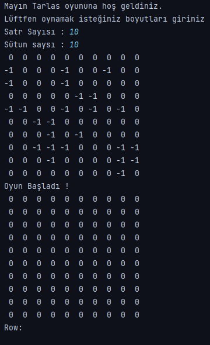

# MİNE SWİPER
- Oyun metin tabanlıdır.
- Çift boyutlu diziler üzerinden oynanmaktadır.
- Matris boyutunu yani satır ve sütun sayısını kullanıcı belirlemektedir.
- Diziye ait eleman sayısının çeyreği (elemanSayisi / 4) kadar rastgele mayın yerleştirilimiştir.
- Kullanıcı matris üzerinden bir nokta seçer. Nokta seçimi için satır ve sütun değerleri girimelidir.
- Kullanıcının girdiği noktada mayın var ise oyunu kaybeder.
- Mayın yok ise, ilgili noktaya değen tüm konumlarına bakılır
  (sağı, solu, yukarısı, aşağısı, sol üst çapraz, sağ üst çapraz, sağ alt çapraz, sol alt çapraz) ve
  etrafındaki mayınların sayısının toplamı gösterilir.
- Noktaya değen herhangi bir mayın yok ise "0" değeri atanır.
- Kullanıcı hiç bir mayına basmadan tüm noktaları seçebilirse oyunu kazanmıştır.

  

